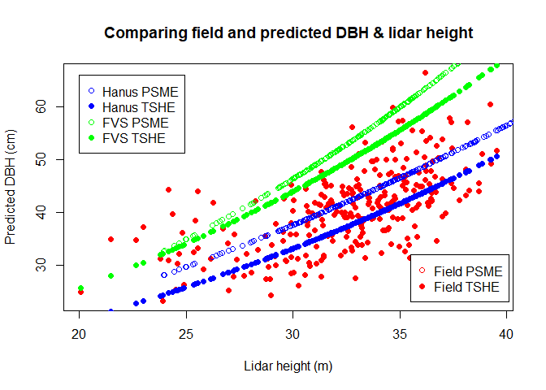
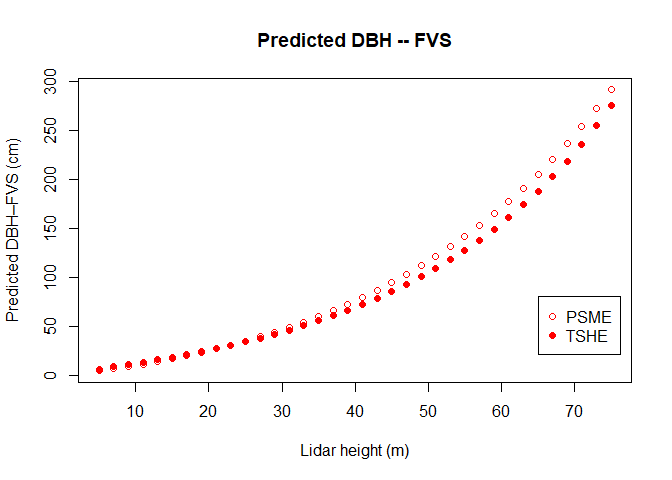
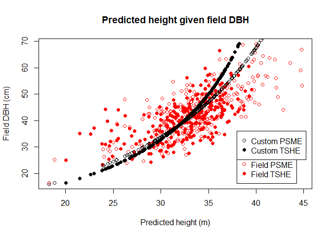

<!-- This document is generated from HeightDBH.Rmd. Please edit that file -->

# Predicting DBH using lidar-derived heights

This report explores the relationship between DBH and height in our 2021
field data for Douglas-fir and western hemlock. Initially, we used
equations from

> Hanus, M.L., D.D. Marshall, and D.W. Hann. 1999. Height-diameter
> equations for six species in the coastal regions of the Pacific
> Northwest. Forestry Research Laboratory, contribution 25. 11 p.

to predict DBH given height. This was accomplished by rearranging the
equations presented in Hanus et al. to produce a DBH given height values
(derived from the individual trees identified using the lidar data).
While this seems to be a reasonable approach, the rearranged equations
introduce bias into the predictions and may not be the best
representation of the relationship between height and DBH. We had a
reviewer for the wind river draft raise this issue but I pretty much
ignored the comment since we didn’t have a better solution at the time.
I also looked into the equations used in the Pacific Coast variant of
FVS as a possible solution. The FVS equations are documented in the
variant description and are specific to geographic regions within the
area covered by the variant. The FVS code provides functions that give
DBH or height but the equations and coefficients are the same.
Basically, an equation was fit describing the relationship between DBH
and height (not sure which was used for fitting but I suspect the
equation was fit to predict height given DBH) and then rearranged to
solve for the “other” variable.

I developed R functions to do the predictions using both sets of
equations along with a pair of functions that allow you to select the
method (“hanus”, “fvs”, or “customT3”). You should use this pair of
functions as they also handle unit conversions more cleanly than the
functions that work with the individual methods. The code for the
prediction functions is in
[predictDBH_Height.R](../Rcode/predictDBH_Height.R).

<span style="color:red">**IMPORTANT NOTE: When trying to use the new
equations to predict DBH for TSHE using lidar-derived heights for TAOs,
I discovered that the model is predicting extremely large DBH values for
reasonable heights. The problems start just outside the range of our
field data and result in values of NaN for heights above \~51 meters. I
think it best to avoid using the new customT3 equations until I can sort
out the problems.**</span>

This document is generated using RMarkdown. The source file is
[HeightDBH.Rmd](../MiniReports/HeightDBH.Rmd). RMarkdown allows you to
mix formatted text with R code. It provides a good way to document R
code but an even better way to automate report generation that includes
R code and inline R statements. The reports can include the R code and
output or “hide” the R code and just present outputs. For me, RMarkdown
seems to work best when I pretty much know what I am doing or where an
analysis is going. For exploratory work where I start with RMarkdown, I
usually end up regretting the choice since the code is more awkward to
run. You can just highlight lines and run them but if you run a block of
code using the buttons in the editor, output gets a little weird.

## Load prediction code and field data

We start by loading the code containing the prediction functions and our
field data. These are both in the repository but in different folders.
Ally and I measured heights to the highest lidar point in each tree used
for the DF/WH species classification. Our method allowed us to consider
lean. I averaged our height measurements and used this as the tree
height for all further comparisons. Tree height was also computed using
an automated method but this method did not consider tree lean. For
trees on steep slopes, I would expect height errors of 1-3m or more.
This error is a combination of tree lean and errors associated with
using the ground elevation under the highest point for the tree (may not
be the base of the tree) to compute a height.

``` r
source("../Rcode/predictDBH_Height.R")

inputDataFile <- "../extras/AdjustedField_T3_Training_TreeTops_AllPlots.csv"

# read data
inputData <- read.csv(inputDataFile, stringsAsFactors = FALSE)

# compute the average height using height measured by Ally and Bob in the point cloud
inputData$aveHt <- (inputData$Total.Height.Ally + inputData$Total.Height.Bob) / 2
```

## Predict DBH for all trees using both methods

I use the Hanus et al. and FVS equations to predict a DBH for all trees.

``` r
fvsDBH <- c()
hanusDBH <- c()
for (i in 1:nrow(inputData)) {
  fvsDBH[i] <- predictDBH(inputData$Species[i]
                          , inputData$aveHt[i]
                          , method = "fvs"
                          , location = 1
                          , heightUnits = "meters"
                          , DBHUnits = "cm")
  hanusDBH[i] <- predictDBH(inputData$Species[i]
                            , inputData$aveHt[i]
                            , method = "hanus"
                            , location = 1
                            , heightUnits = "meters"
                            , DBHUnits = "cm")
}

inputData$fvsDBH <- fvsDBH
inputData$hanusDBH <- hanusDBH
```

This scatterplot show the relationship between our field-measured DBH
and lidar-derived tree heights. Note that these are only trees where a
field tree could be matched with a lidar-derived tree. This means that
most (maybe all) trees are in dominant or co-dominant crown positions.
In addition, these data only include Douglas-fir and western hemlock
trees. These two species account for about 98% of the trees in the field
data.

``` r
DF <- inputData[inputData$Species == "PSME", ]
WH <- inputData[inputData$Species == "TSHE", ]
plot(DF$aveHt, DF$DBH_cm
     , col = "red"
     , pch = 1
     , ylab = "Predicted DBH (cm)"
     , xlab = "Lidar height (m)"
     , main = "Comparing field and predicted DBH & lidar height")
points(WH$aveHt, WH$DBH_cm
       , col = "red", pch = 16)
legend(36, 25, c("Field PSME", "Field TSHE")
       , pch = c(1, 16)
       , col = c("red", "red"))
```

<!-- -->

## Compare predictions from the two methods

Next I add the predicted DBH values from the two methods. I think that
both methods were fit to predict height given a DBH value so we are
working with rearranged equations in both cases. In general, the Hanus
et al. equations produce DBH values that are smaller for a given height
and seem to fit our data better than the FVS equations.

``` r
plot(DF$aveHt, DF$DBH_cm
     , col = "red", pch = 1
     , ylab = "Predicted DBH (cm)"
     , xlab = "Lidar height (m)"
     , main = "Comparing field and predicted DBH & lidar height")
points(WH$aveHt, WH$DBH_cm, col = "red", pch = 16)
legend(36, 25, c("Field PSME", "Field TSHE")
       , pch = c(1, 16)
       , col = c("red", "red"))

points(DF$aveHt, DF$fvsDBH
       , col = "green", pch = 1)
points(WH$aveHt, WH$fvsDBH
       , col = "green", pch = 16)

points(DF$aveHt, DF$hanusDBH
       , col = "blue", pch = 1)
points(WH$aveHt, WH$hanusDBH
       , col = "blue", pch = 16)

legend(20, 70, c("Hanus PSME", "Hanus TSHE", "FVS PSME", "FVS TSHE")
       , pch = c(1, 16, 1, 16)
       , col = c("blue", "blue", "green", "green"))
```

<!-- -->

However, there is some bias in the predictions. Less bias with the Hanus
et al. equations compared to the FVS predictions but still somewhat
concerning. These histograms show the distribution of prediction errors
and the titles give the average error (bias).

``` r
{ # force all lines to execute as one...prevents splitting the code before and after the graphs
par(mfrow=c(2,2))
hist(DF$fvsDBH - DF$DBH_cm
     , main = paste0("FVS DBH error -- DF (bias = ", round(mean(DF$fvsDBH - DF$DBH_cm), 2), " cm)")
     , xlab = "DBH error (cm)")
hist(DF$hanusDBH - DF$DBH_cm
     , main = paste0("Hanus DBH error -- DF (bias = ", round(mean(DF$hanusDBH - DF$DBH_cm), 2), " cm)")
     , xlab = "DBH error (cm)")
hist(WH$fvsDBH - WH$DBH_cm
     , main = paste0("FVS DBH error -- WH (bias = ", round(mean(WH$fvsDBH - WH$DBH_cm), 2), " cm)")
     , xlab = "DBH error (cm)")
hist(WH$hanusDBH - WH$DBH_cm
     , main = paste0("Hanus DBH error -- WH (bias = ", round(mean(WH$hanusDBH - WH$DBH_cm), 2), " cm)")
     , xlab = "DBH error (cm)")
par(mfrow = c(1, 1))
}
```

<!-- -->

## Fit new equations

### Predict height given DBH

Given that we have field-measured DBH and lidar-derived height values
for several hundred trees, it makes sense to try fitting our own
equations to predict DBH given height. First, I tried fitting an
equation that predicts height given DBH (this is the same approach used
by both FVS and Hanus et al.). I used the same equation form as that
used by Hanus et al. but used height in meters and DBH in cm:

> Height(m) = 1.37 + exp(a<sub>0</sub> +
> a<sub>1</sub>(DBH(cm)<sup>a<sub>2</sub></sup>))

``` r
DFadd_nls <- nls(data = DF, aveHt ~ 1.37 + exp(a0 + a1 * DBH_cm ^ a2),
                 start = list(a0 = 7.0, a1 = -6.0, a2 = -0.25))
DFnls_coeff <- coef(DFadd_nls)

plot(DF$aveHt, DF$DBH_cm, col = "red", pch = 1, ylab = "Field DBH (cm)", xlab = "Predicted height (m)", main = "Predicted height given field DBH")
points(WH$aveHt, WH$DBH_cm, col = "red", pch = 16)
legend(38, 27, c("Field PSME", "Field TSHE"), pch = c(1, 16), col = c("red", "red"))

# predict heights
DF$predHt <- (log((DF$aveHt - 1.37) / exp(DFnls_coeff["a0"])) / DFnls_coeff["a1"])^(1 / DFnls_coeff["a2"])
                                                                                   
# plot predicted DBH using lidar height
points(DF$aveHt, DF$predHt, col = "black", pch = 1)

# fit new model for WH using Hanus equation form
# DBH in cm and height in m
WHadd_nls <- nls(data = WH, aveHt ~ 1.37 + exp(a0 + a1 * DBH_cm ^ a2),
                 start = list(a0 = 7.0, a1 = -6.0, a2 = -0.25))
WHnls_coeff <- coef(WHadd_nls)

# predict heights
WH$predHt <- (log((WH$aveHt - 1.37) / exp(WHnls_coeff["a0"])) / WHnls_coeff["a1"])^(1 / WHnls_coeff["a2"])

points(WH$aveHt, WH$predHt, col = "black", pch = 16)

# plot predicted height using field DBH
#points(4.5 + exp(WHnls_coeff[1] + WHnls_coeff[2] * WH$DBH_cm ^ WHnls_coeff[3]), WH$DBH_cm, col = "magenta", pch = 16)

legend(38, 36, c("Custom PSME", "Custom TSHE"), pch = c(1, 16), col = c("black", "black"))
```

<!-- -->

The resulting predictions seem to do better with our data. However, the
predicted heights at the ends of the DBH distribution don’t look great.
Note that the graph above has the predicted height on the x axis. This
is not conventional but makes comparison with other graphs easier.

The equation to predict height in meters given DBH in cm is of the form:

> Height(m) = 1.37 + exp(a<sub>0</sub> +
> a<sub>1</sub>(DBH(cm)<sup>a<sub>2</sub></sup>))

Coefficients for DF and WH are provided in the following table.

| Species | a<sub>0</sub> | a<sub>1</sub> | a<sub>2</sub> |
|---------|---------------|---------------|---------------|
| DF      | 5.0199        | -4.7311       | -0.2982       |
| WH      | 3.758         | -22.9194      | -1.1665       |

### Predict DBH given height

Next I fit the same equation form rearranged to predict DBH given
height:

> DBH(cm) = (log((Height(m) - 1.37) / exp(a<sub>0</sub>)) /
> a<sub>1</sub>)<sup>(1/a<sub>2</sub>)</sup>

These results do better at the ends of the DBH distribution and appear
to fit our data very well.

``` r
library(nls2)
#> Warning: package 'nls2' was built under R version 4.2.2
#> Loading required package: proto
#> Warning: package 'proto' was built under R version 4.2.2
DFadd_nls <- nls(data = DF, DBH_cm ~ (log((aveHt - 1.37) / exp(a0)) / a1) ^ (1 / a2),
                 start = list(a0 = 7.0, a1 = -6.0, a2 = -0.25))
DFnls_coeff <- coef(DFadd_nls)

plot(DF$aveHt, DF$DBH_cm, col = "red", pch = 1, ylab = "Predicted DBH (cm)", xlab = "Lidar height (m)", main = "Predicted DBH given lidar height")
points(WH$aveHt, WH$DBH_cm, col = "red", pch = 16)
legend(38, 27, c("Field PSME", "Field TSHE"), pch = c(1, 16), col = c("red", "red"))

DF$predDBH <- (log((DF$aveHt - 1.37) / exp(DFnls_coeff["a0"])) / DFnls_coeff["a1"])^(1 / DFnls_coeff["a2"])
points(DF$aveHt, DF$predDBH, col = "orange", pch = 1)

# plot predicted height using field DBH
#points(4.5 + exp(DFnls_coeff[1] + DFnls_coeff[2] * DF$DBH_cm ^ DFnls_coeff[3]), DF$DBH_cm, col = "magenta", pch = 1)

WHadd_nls <- nls(data = WH, DBH_cm ~ (log((aveHt - 1.37) / exp(a0)) / a1) ^ (1 / a2),
                 start = list(a0 = 4, a1 = -28, a2 = -1))
WHnls_coeff <- coef(WHadd_nls)

WH$predDBH <- (log((WH$aveHt - 1.37) / exp(WHnls_coeff["a0"])) / WHnls_coeff["a1"])^(1 / WHnls_coeff["a2"])

points(WH$aveHt, WH$predDBH, col = "orange", pch = 16)

legend(38, 36, c("Custom PSME", "Custom TSHE"), pch = c(1, 16), col = c("orange", "orange"))
```

<!-- -->

These histograms show the distribution of prediction errors for the new
equation that predicts DBH directly and the titles give the average
error (bias).

``` r
{ # force all lines to execute as one...prevents splitting the code before and after the graphs
par(mfrow=c(1,2))
hist(DF$predDBH - DF$DBH_cm
     , main = paste0("DBH error -- DF (bias = ", round(mean(DF$predDBH - DF$DBH_cm), 2), " cm)")
     , xlab = "DBH error (cm)")
hist(WH$predDBH - WH$DBH_cm
     , main = paste0("DBH error -- WH (bias = ", round(mean(WH$predDBH - WH$DBH_cm), 2), " cm)")
     , xlab = "DBH error (cm)")
par(mfrow = c(1, 1))
}
```

<!-- -->

## Summary

Overall, fitting new equations using our field data and lidar-derived
heights should give us a prediction model useful for the entire T3 study
area. The Hanus et al. equations were fit to SMC data from British
Columbia, western Washington, and northwestern Oregon. While all of
these data are from the general region, it is well known that conditions
on the Olympic Peninsula are different from “typical” westside forest
conditions. The FVS equations were fit using thousands of tree
measurements from FIA. The pacific coast variant includes multiple
geographic regions with different model forms and coefficients for each
region. While FVS uses a more comprehensive data set, it appears to
predict larger DBH values (or shorter heights for a given DBH value)
than we see in our data.

The final equation to predict DBH directly is of the form:

> DBH(cm) = (log((Height(m) - 1.37) / exp(a<sub>0</sub>)) /
> a<sub>1</sub>)<sup>(1/a<sub>2</sub>)</sup>

Coefficients for DF and WH are provided in the following table.

| Species | a<sub>0</sub> | a<sub>1</sub> | a<sub>2</sub> |
|---------|---------------|---------------|---------------|
| DF      | 10.7258       | -11.0555      | -0.1118       |
| WH      | 3.9072        | -752.7518     | -2.0014       |
