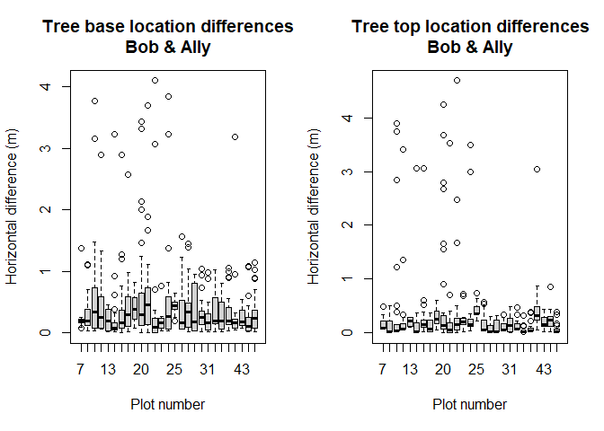
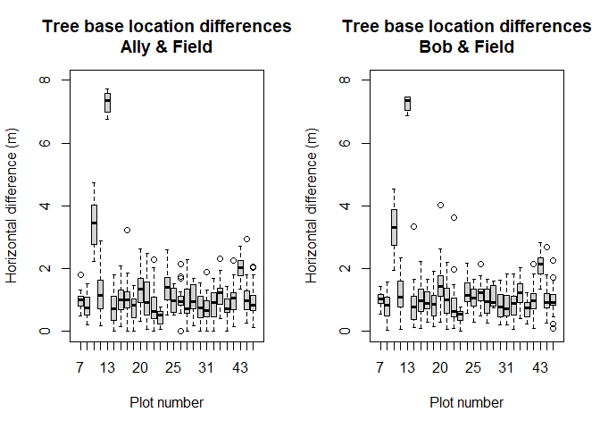
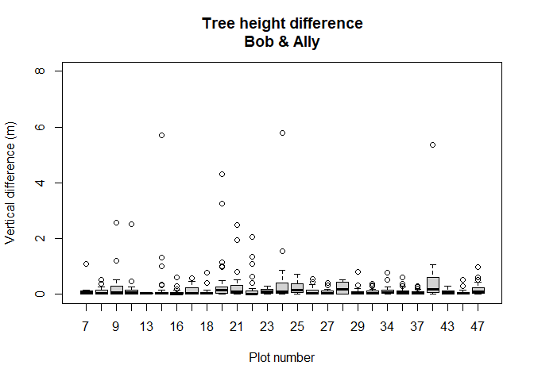
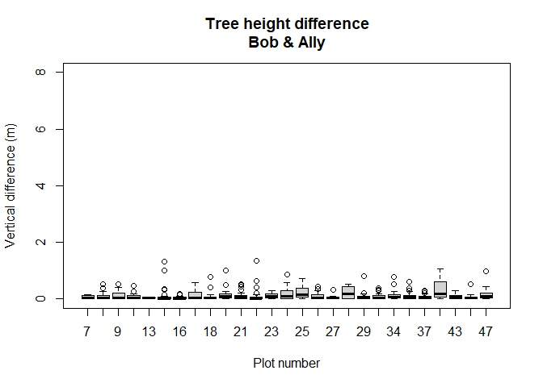
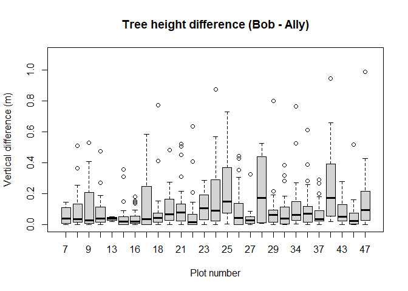
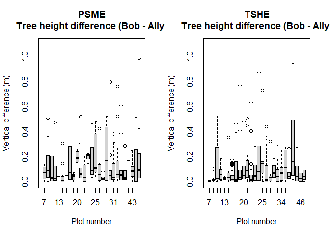

<!-- TreeRelocation.md is generated from TreeRelocation.Rmd. Please edit that file -->

# Tree relocation

Our protocol for plot locations includes collection of survey-grade GNSS
data for at least 15 minutes over a reference point for each plot. These
data were differentially corrected using post-processing and a nearby
CORS base station. From previous work, we know that position accuracy is
in the range of 1-2m under dense canopy with some locations with errors
of up to \~5m. Unfortunately, there are no indicators to tell us when a
large error occurs. This all has to do with the geometry of the large
trees in the area, atmospheric conditions, and satellite geometry when
data are collected. We use the plot location as a starting point to
develop stem maps for each plot using the azimuth and distance the
center of each tree. Using FUSION, we can display individual tree models
in the point cloud and compare our tree locations with the point data
that presumably represents the same trees. Overall our locations are
good. However, when we are working with high density airborne lidar data
with accuracy in the 10-20cm range, even slight errors can result in
errors when matching trees detected using the point cloud or derived
products to our field trees.

For this project, we manually adjusted tree locations and tree lean to
ensure that field trees were correctly matched to lidar-derived trees.
The manual adjustment process was facilitated by modifications to FUSION
and the LDV data viewer. These modifications allow you to adjust all
trees on a plot to correct GNSS errors as well as individual tree base
and top locations to correct azimuth or distance errors and errors in
the top location due to tree lean. Adjustments were done independently
by two people giving us an idea of the consistency and repeatability of
the adjustment process.

The adjustment process is described in a separate document (MS word
document). Basically, the process involves displaying tree models in the
point cloud and providing the ability to adjust the location of all
trees on a plot and individual trees. With the high-density UAS lidar
data (\~1000 pulse/m<sup>2</sup>), we often have enough hits on stems to
allow us to align the tree models with stem hits. For overall plot
adjustments, having stem hits for a few trees on the plot is enough to
shift all of the trees to approximate locations. Once the overall
adjustment is completed, individual tree adjustments can be done. For
individual trees, we tended to start with the tallest trees on the plot.
We moved the base fo the tree to align with stem hits when possible. In
the absence of stem hits, we relied on the upper canopy points to
position trees and then adjusted the base location to align with the
crown center. In many case, we found that stem hits in the upper drown
were evident once the initial adjustments were made. Once we were
satisifed with the base location, we adjusted the location of the tree
top to align with the bulk of the crown returns. In some cases, we could
use the highest point in the crown to position the top but often the
highest point was not centered on the crown. For such cases, we snapped
the tree top to the highest point in the crown but then adjusted the
horizontal location so the geometric primitive representing the tree
crown better encompassed the crown.

The data for the adjusted locations is in
[AdjustedTrees_AllPlots.csv](../extras/AdjustedTrees_AllPlots.csv).

``` r
originalPlotTrees <- read.csv(file = "../extras/AdjustedTrees_AllPlots.csv", stringsAsFactors = FALSE)
```

There are 624 trees that were adjusted.

## Comparing adjustments

As mentioned above, two people independently adjusted the trees allowing
us to compare the results of the adjustment process. The following
boxplots show the differences between the base and top locations for the
two people for each plot. Overall, the locations agree well. Differences
for he tree bases are a little larger, probably because it is harder to
find points on the stems compared to the tree tops.

``` r
{
par(mfrow=c(1,2))
boxplot(diff ~ PlotID, data = originalPlotTrees
        , main = "Tree base location differences\nBob & Ally"
        , xlab = "Plot number"
        , ylab = "Horizontal difference (m)")
boxplot(diffTop ~ PlotID, data = originalPlotTrees
        , main = "Tree top location differences\nBob & Ally"
        , xlab = "Plot number"
        , ylab = "Horizontal difference (m)")
par(mfrow=c(1,1))
}
```

<!-- -->

These histograms provide the distribution of the differences.

``` r
{
par(mfrow=c(1,2))
hist(originalPlotTrees$diff, main = "Tree base location difference (m)")
hist(originalPlotTrees$diffTop, main = "Tree top location difference (m)")
par(mfrow=c(1,1))
}
```

<!-- -->

These boxplots show the difference from the original tree locations
(base and top) and the new locations for each person. These plots
highlight the apparent errors in the original plot location for plots 9
and 13. These are the boxes that stand above all the others.

``` r
{
par(mfrow=c(1,2))
boxplot(origdiff.Ally ~ PlotID, data = originalPlotTrees
        , main = "Tree base location differences\nAlly & Field"
        , ylim = c(0, 8)
        , xlab = "Plot number"
        , ylab = "Horizontal difference (m)")
boxplot(origdiff.Bob ~ PlotID, data = originalPlotTrees
        , main = "Tree base location differences\nBob & Field"
        , ylim = c(0, 8)
        , xlab = "Plot number"
        , ylab = "Horizontal difference (m)")
par(mfrow=c(1,1))
}
```

<!-- -->

Finally, this plot shows the difference in tree height for the two
people.

``` r
boxplot(heightdiff ~ PlotID, data = originalPlotTrees
        , main = "Tree height difference\nBob & Ally"
        , ylim = c(0, 8)
        , xlab = "Plot number"
        , ylab = "Vertical difference (m)")
```

<!-- -->

To help eliminate any mismatched trees, I assumed that trees with
position differences greater than 1m or height differences greater than
1m were likely due to matching different field trees to trees evident in
the lidar point cloud. I first removed any trees with a location
difference greater than 1m. This plot shows the height differences for
the remaining trees.

``` r
# drop any trees where the base locations differ by more than 1m
distThreshold <- 1
trainingTrees <- originalPlotTrees[originalPlotTrees$diff <= distThreshold, ]

#580 trees after filtering to remove trees with horizontal position differences > 1m

# height differences between Ally & Bob for trees within 1m
boxplot(heightdiff ~ PlotID, data = trainingTrees
        , main = "Tree height difference\nBob & Ally"
        , ylim = c(0, 8)
        , xlab = "Plot number"
        , ylab = "Vertical difference (m)")
```

<!-- -->

While it certainly possible that the two people selected different high
points for some trees, I assumed that trees with more than 1m of
difference in the heights were different trees so I dropped them from
the set of trees used for training our classification model. The plot
shows the height difference for the final set of trees.

``` r
heightThreshold <- 1
trainingTrees <- trainingTrees[trainingTrees$heightdiff <= heightThreshold, ]

# 575 trees after filtering based on location and height difference thresholds

# height difference between Bob & Ally for final trees
boxplot(heightdiff ~ PlotID, data = trainingTrees
        , main = "Tree height difference (Bob - Ally)"
        , ylim = c(0, 1.1)
        , xlab = "Plot number"
        , ylab = "Vertical difference (m)")
```

<!-- -->

Given that we are using the upper crown morphology to distinguish
Douglas-fir from western hemlock, I thought there might be some
relationship between species and the height error. The following plots
show the errors by species. It doens’t look like there is any
reltionship between the height differences and species.

``` r
{
par(mfrow=c(1,2))
boxplot(heightdiff ~ PlotID, data = trainingTrees[trainingTrees$Species == "PSME",]
        , main = "PSME\nTree height difference (Bob - Ally)"
        , ylim = c(0, 1.1)
        , xlab = "Plot number"
        , ylab = "Vertical difference (m)")
boxplot(heightdiff ~ PlotID, data = trainingTrees[trainingTrees$Species == "TSHE",]
        , main = "TSHE\nTree height difference (Bob - Ally)"
        , ylim = c(0, 1.1)
        , xlab = "Plot number"
        , ylab = "Vertical difference (m)")
par(mfrow=c(1,1))
}
```

<!-- -->
